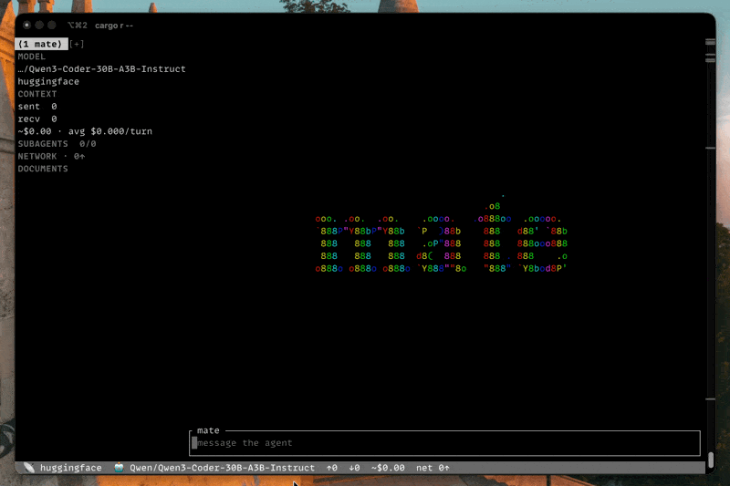

# mate



A terminal coding agent. `mate` chats with a HuggingFace-hosted model over your workspace,
can read files and make outbound HTTP requests on your own behalf, and can delegate narrow
sub-tasks to short-lived subordinate agents so its own context stays small. It runs either as a
tabbed TUI (the default) or as a plain, script-friendly stdout stream.

> **Before you start:** mate can read files inside your workspace and reach the network. Review
> the [Safety](#safety) and [Configuration](#configuration) sections below before pointing it at
> anything sensitive.

## Requirements

- Rust `1.97.1` or later (a `rust-toolchain.toml` in this repo pins the exact version if you
  build from source — `rustup` will pick it up automatically).
- A HuggingFace API token with access to Inference Providers. Get one at
  <https://huggingface.co/settings/tokens>.

## Install

From this repository:

```sh
cargo install --path crates/mate-cli
```

This installs a `mate` binary onto your `$PATH` (usually `~/.cargo/bin/mate`).

## Quick start

```sh
export API_TOKEN=hf_...
mate
```

That opens the tabbed TUI, rooted at your current directory. Type a message and press `Enter`;
`Alt+Enter` inserts a newline instead of sending. `Ctrl+C` cancels an in-flight turn, or quits on
a second press with nothing running. `Ctrl+T` opens a new tab; `Ctrl+W` closes the active one.

For a one-shot, non-interactive turn (useful in scripts and pipes):

```sh
mate -p "summarize the failing test in tests/foo.rs"
```

`API_TOKEN` is read from the environment only — it is never written to or read from a config
file.

## The TUI

### Tabs

Each tab is one independent session: its own conversation history, workspace root, model, and
tool policy. `-C`/`--dir` (repeatable) opens one tab per path at startup:

```sh
mate -C ~/work/api -C ~/work/frontend
```

| Key | Action |
|---|---|
| `Ctrl+T` | Open a new tab (prompts for a directory, model override, and http on/off) |
| `Ctrl+W` | Close the active tab (press again to confirm if it's mid-turn) |
| `Alt+1`…`Alt+9`, `Ctrl+←`/`Ctrl+→` | Switch tabs |
| `Ctrl+G` | Jump to the next tab that needs attention (unread activity or an error) |
| `Ctrl+C` | Cancel the active tab's turn; press again with nothing running to quit |

### The agent status panel

`Ctrl+B` toggles a side panel showing that tab's model, token/cost usage, any subordinate agents
it has spawned, a network request log, and a file-activity log. It automatically hides on narrow
terminals and degrades to a one-line summary in the status bar instead.

| Key | Action |
|---|---|
| `Ctrl+P` | Focus the panel for keyboard navigation (`Esc` or any printable key returns focus to the input) |
| `Tab` / `Shift+Tab` | Move between panel widgets |
| `↑` / `↓` | Move between rows in the focused list |
| `Enter` | Open a read-only detail view for the focused row, or toggle the context widget's root/subagent split |
| `x` | Cancel the focused subagent |
| `Ctrl+O` | Expand/collapse the most recent tool call in the transcript |

Subordinate agents ("subagents") are never addressable directly — there is no way to type a
message to one. They're spawned by the root agent to investigate something narrow, return a
short report, and disappear; if you want to change direction, talk to the root agent and it will
respawn with a better task.

### Approvals

Some actions (currently none by default, but the mechanism exists for future risky tools) can
require your explicit sign-off. When one does, a modal appears on whichever tab requested it —
`y` grants, `n`/`Esc` denies, and an unanswered request auto-denies after five minutes rather
than hanging the agent forever. A request from a background tab never interrupts what you're
typing in the active one; it just marks that tab as needing attention.

### Slash commands

Typed into the input box like a normal message, but never sent to the model:

| Command | Effect |
|---|---|
| `/new [dir]` | Open a new tab rooted at `dir` (default: current directory) |
| `/close` | Close the active tab |
| `/rename <name>` | Rename the active tab |
| `/model [id]` | Show the active tab's model, or set the default for tabs opened after this |
| `/provider [name]` | Show the active tab's HuggingFace sub-provider, or set the default |
| `/tools` | List the tools actually attached to the active tab's agent |
| `/http [on\|off]` | Show whether the active tab's agent can reach the network, or set the default |
| `/clear` | Clear the active tab's transcript |
| `/tokens` | Show token usage and estimated cost so far |
| `/quit` | Quit immediately |

`/model`, `/provider`, and `/http` only affect tabs opened *after* you run them — a running
agent's model and toolset are fixed at the moment it was built and can't be swapped live. Open a
fresh tab (`/new` or `Ctrl+T`) to pick up the change.

Long sessions are compacted automatically: once a turn's prompt size crosses roughly 70% of a
conservative context budget, mate summarizes everything except the last couple of exchanges into
one condensed entry, so the conversation keeps going instead of failing outright.

## The plain frontend

`--plain` (interactive, one turn per line of stdin) and `-p`/`--print` (one shot) both stream
plain, ANSI-free text — safe to pipe. `mate` also switches to plain mode automatically if you
give it a prompt on a non-TTY stdout, so `mate "..." | less` does the right thing without
remembering the flag.

## CLI reference

```
mate [PROMPT]
  -m, --model <ID>              root agent model
      --subagent-model <ID>     defaults to the root model; a cheaper one is usually right
      --provider <NAME>         HuggingFace sub-provider
  -C, --dir <PATH>...           workspace root; repeat for one tab per path
      --plain                   line-based stdout, single session
  -p, --print                   one-shot turn, print, exit (requires a prompt)
      --no-http                 disable the http_request tool
      --no-delegate             disable the spawn_agent tool
      --http-allow-localhost    permit the http tool to reach loopback addresses
      --max-sessions <N>        maximum concurrent tabs (default 8)
      --max-subagents <N>       maximum concurrent subagents per session (default 4)
      --max-turns <N>           model-call budget per turn (default 12)
      --config <FILE>           explicit config file, replacing the ./.mate.toml lookup
```

Run `mate --help` for the authoritative, up-to-date list.

## Configuration

Layered, highest precedence first: CLI flags → `MATE_*` environment variables → `./.mate.toml`
(or `--config`) → `~/.config/mate/config.toml` (`$XDG_CONFIG_HOME/mate/config.toml` if set) →
built-in defaults. Missing files are skipped silently, not an error.

```toml
model = "Qwen/Qwen3-Coder-30B-A3B-Instruct"
sub_provider = "together"   # optional; unset uses HuggingFace's own routing
max_sessions = 8
max_turns = 12

[delegation]
enabled = true
subagent_model = "Qwen/Qwen3-32B"
max_depth = 1                    # deeper delegation trees are opt-in only, never model-controlled
max_concurrent = 4
max_total_per_turn = 8
subagent_max_turns = 8
wall_clock_timeout_secs = 120
report_max_bytes = 2048

[tools]
max_output_bytes = 262144
deny = [".env", "*.pem", "id_rsa*"]

[panel]
visible = true
width_ratio = [3, 12]
network_log_len = 50
documents_log_len = 50

[http]
enabled = true
policy = "public"                # or "allow_localhost"
rate_limit_per_host_per_min = 20 # shared across every tab and subagent in the process

# USD per 1M tokens — drives the panel's cost estimate. HuggingFace routes billing through
# partner providers and doesn't return a cost figure on the response, so this table is the only
# source of the "~$" estimate; a model missing from it shows "~$?" rather than a silent zero.
[pricing]
"Qwen/Qwen3-Coder-30B-A3B-Instruct" = { input = 0.40, output = 1.60 }
"Qwen/Qwen3-32B"                    = { input = 0.10, output = 0.30 }
```

`API_TOKEN` is never a config field — set it as an environment variable only.

Logs go to `$XDG_STATE_HOME/mate/mate.log` (or `~/.local/state/mate/mate.log`), never to
stdout/stderr — the TUI owns the terminal, and `--plain` output stays script-clean. Set
`RUST_LOG` to control the level (defaults to `info`).

## Safety

Read this before pointing mate at a workspace or model you don't fully trust:

- **File access is jailed to the workspace root** you started mate in (or `-C`'d it to). Paths
  are canonicalized before any check, so both `../` traversal and a symlink pointing outside the
  root are rejected — not just a naive prefix check. `.env`, `*.pem`, `id_rsa*`, and anything
  under `.git/` are refused outright, in-jail or not.
- **Outbound HTTP is guarded against SSRF.** Only `http`/`https`, only `GET`/`HEAD`. Every
  resolved IP — including every redirect hop, re-validated individually, capped at 5 — is
  checked against loopback, private, link-local (this blocks cloud metadata endpoints),
  unspecified, multicast, and CGNAT ranges before a connection is ever opened. Model-supplied
  `Authorization`/`Cookie`/`Proxy-Authorization` headers are refused; credentials only ever come
  from your own configuration.
- **A subagent can only ever have a subset of its parent's tools and access**, never more.
  Delegation depth defaults to 1 and is a config-only knob — a model can never ask for a deeper
  tree itself.
- **A subagent is not addressable.** Its entire input is fixed at the moment it's spawned; there
  is no way — in the UI or in the underlying types — for you or the parent agent to send it
  anything afterward. You can watch it, read its full trace, or cancel it, and that's all.
- Rate limits (`[http].rate_limit_per_host_per_min`) are enforced **process-wide**, shared by
  every open tab and every subagent, specifically so a multi-tab, multi-subagent session can't
  multiply your effective rate against one host.

None of this makes mate safe to point at a workspace containing secrets you don't want an LLM to
ever see, or to run genuinely unattended against untrusted input — it reduces the blast radius of
a model doing something confused or a page trying to inject instructions into it, not eliminates
the risk.

## Project layout

```
crates/
├── mate-cli/        # the `mate` binary: args, config, frontend selection
├── mate-core/        # agent construction, session manager, subagent runtime
├── mate-tool-api/    # shared tool contracts (ToolCtx, errors, approvals, delegation seam)
├── mate-tool-fs/     # read_file, list_dir, find_files
├── mate-tool-http/   # http_request, with the SSRF guards described above
├── mate-tool-agent/  # spawn_agent — delegation within a session
└── mate-tui/         # the Ratatui frontend: tabs, panel, transcript
```

See `CONTRIBUTING.md` for the error-handling and testing conventions this workspace follows.
